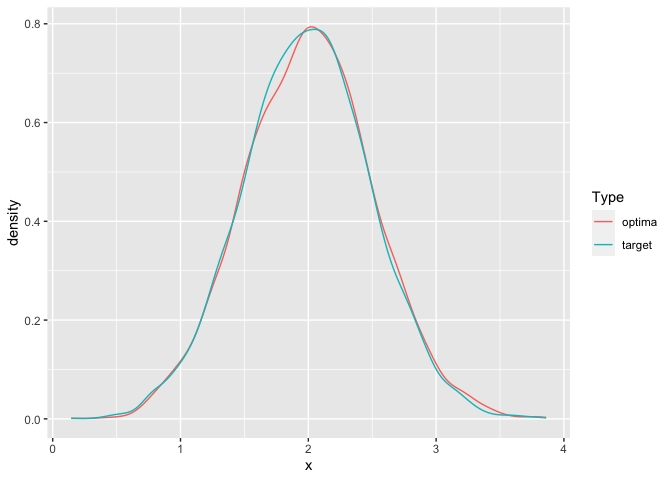

<!-- README.md is generated from README.Rmd. Please edit that file -->

# `pbbo` – Prior by Bayesian Optimisation

<!-- badges: start -->

[](https://github.com/hhau/pbbo/actions/workflows/R-CMD-check.yaml)
[](https://zenodo.org/badge/latestdoi/470232798)
<!-- badges: end -->

`pbbo` uses information you supply about the prior predictive
distribution to help you find a prior for the parameters in your
Bayesian model.

## Installation

You can install the development version of pbbo from
[GitHub](https://github.com/hhau/pbbbo) with:

``` r
# install.packages("devtools")
devtools::install_github("hhau/pbbo")
```

## A simple example

Suppose the target distribution is `N(0, 0.5^2)`. We define the target
LCDF and function to draws samples from the target:

``` r
library(pbbo)
suppressPackageStartupMessages(library(ParamHelpers))

target_lcdf <- function(x) {
  Rmpfr::pnorm(x, mean = 2, sd = 0.5, log.p = TRUE)
}

target_sampler <- function(n) {
  rnorm(n = n, mean = 2, sd = 0.5)
}
```

and define a the prior predictive distribution of a model (and its
hyperparameters):

``` r
prior_predictive_sampler <- function(n, lambda) {
  rnorm(n = n, mean = lambda["mu"], sd = lambda["sigma"])
}

param_set <- makeParamSet(
  makeNumericParam(id = "mu", lower = -50, upper = 50),
  makeNumericParam(id = "sigma", lower = 0, upper = 20)
)
```

We can then call `pbbo` to get optimal values of λ = (μ, σ)

``` r
pbbo_res <- suppressWarnings(pbbo(
  target_lcdf = target_lcdf,
  target_sampler = target_sampler,
  prior_predictive_sampler = prior_predictive_sampler,
  param_set = param_set,
  n_crs2_iters = 300,
  n_internal_prior_draws = 5e3,
  n_internal_importance_draws = 1e3,
  importance_method = "uniform",
  bayes_opt_batches = 1,
  bayes_opt_iters_per_batch = 50,
  bayes_opt_design_points_per_batch = 40
))
#> INFO [2023-01-30 14:11:24] Starting stage one CRS2 optimiser
#> INFO [2023-01-30 14:11:31] Starting Bayes opt batch 1

opt_lambda <- pbbo_res %>%
  get_best_lambda()

print(opt_lambda)
#>       mu    sigma 
#> 2.001364 0.501134
```

We can compare the prior predictive distribution at the optima against
the target:

``` r
suppressPackageStartupMessages(library(ggplot2))
suppressPackageStartupMessages(library(dplyr))
suppressPackageStartupMessages(library(tibble))

n_plot_samples <- 5e3

plot_tbl <- tibble(
  x = c(
    prior_predictive_sampler(n_plot_samples, opt_lambda),
    target_sampler(n_plot_samples)
  ),
  grp = rep(c("optima", "target"), each = n_plot_samples)
)

ggplot(plot_tbl) +
  geom_line(
    mapping = aes(x = x, colour = grp),
    stat = "density"
  ) +
  labs(colour = "Type")
```



## A more complex, multi-objective example.

Suppose now we have an under-specified problem. In these settings we
require additional criteria to provide a form of regularisation.

Consider the same target as the previous example:

``` r
library(pbbo)
suppressPackageStartupMessages(library(ParamHelpers))

target_lcdf <- function(x) {
  Rmpfr::pnorm(x, mean = 2, sd = 0.5, log.p = TRUE)
}

target_sampler <- function(n) {
  rnorm(n = n, mean = 2, sd = 0.5)
}
```

Now instead consider a hierarchical model for the outcome:

``` r
hiearchical_prior_predictive_sampler <- function(n, lambda) {
  indiv_mu <- rnorm(n = n, mean = lambda["pop_loc"], sd = lambda["pop_scale"])
  noise_sd <- rgamma(n = n, shape = lambda["noise_shape"], rate = lambda["noise_rate"])
  res <- rnorm(n = n, mean = indiv_mu, sd = noise_sd)
}

param_set <- makeParamSet(
  makeNumericParam(id = "pop_loc", lower = -50, upper = 50),
  makeNumericParam(id = "pop_scale", lower = 0 + 1e-6, upper = 20),
  makeNumericParam(id = "noise_shape", lower = 2, upper = 20),
  makeNumericParam(id = "noise_rate", lower = 2, upper = 20)
)
```

In this example we can attribute variability in the target to either
variation in the population mean, or noise in the measurement process.
Such types of models are ill-advised, we are using this one for
illustration only. For reference, we naively employ the single objective
approach.

``` r
pbbo_single_objective_res <- suppressWarnings(pbbo(
  target_lcdf = target_lcdf,
  target_sampler = target_sampler,
  prior_predictive_sampler = hiearchical_prior_predictive_sampler,
  param_set = param_set,
  n_crs2_iters = 300,
  n_internal_prior_draws = 5e3,
  n_internal_importance_draws = 1e3,
  importance_method = "uniform",
  bayes_opt_batches = 1,
  bayes_opt_iters_per_batch = 50,
  bayes_opt_design_points_per_batch = 40
))
#> INFO [2023-01-30 14:12:07] Starting stage one CRS2 optimiser
#> INFO [2023-01-30 14:12:12] Starting Bayes opt batch 1
```

`pbbo` also accepts a secondary objective, which we set to be the
negative mean of the log marginal standard deviations for the structural
parameters:

``` r
neg_mean_log_sd <- function(lambda) {
  sds <- c(
    lambda["pop_scale"],
    sqrt(lambda["noise_shape"]) / lambda["noise_rate"]
  ) %>%
    log() %>%
    mean() %>%
    magrittr::multiply_by(-1)

  return(sds)
}

pbbo_multi_objective_res <- suppressWarnings(pbbo(
  target_lcdf = target_lcdf,
  target_sampler = target_sampler,
  prior_predictive_sampler = hiearchical_prior_predictive_sampler,
  param_set = param_set,
  n_crs2_iters = 300,
  n_internal_prior_draws = 5e3,
  n_internal_importance_draws = 1e3,
  importance_method = "uniform",
  bayes_opt_batches = 1,
  bayes_opt_iters_per_batch = 50,
  bayes_opt_design_points_per_batch = 40,
  extra_objective_term = neg_mean_log_sd
))
#> INFO [2023-01-30 14:12:59] Starting stage one CRS2 optimiser
#> Loading required package: mco
#> Loading required package: emoa
#> 
#> Attaching package: 'emoa'
#> The following object is masked from 'package:dplyr':
#> 
#>     coalesce
#> INFO [2023-01-30 14:13:03] Starting Bayes opt batch 1
```

Compare the results on the observable scale:

``` r
pal_colours <- scales::hue_pal()(3)

obs_scale_plot_tbl <- tibble(
  x = c(
    target_sampler(n_plot_samples),
    pbbo_single_objective_res %>%
      get_best_lambda() %>%
      hiearchical_prior_predictive_sampler(n = n_plot_samples, lambda = .),
    pbbo_multi_objective_res %>%
      get_best_lambda(pbbo_kappa = 0.75) %>%
      hiearchical_prior_predictive_sampler(n = n_plot_samples, lambda = .)
  ),
  grp = rep(c("target", "single obj", "multi obj"), each = n_plot_samples)
)

ggplot(obs_scale_plot_tbl) +
  geom_line(
    mapping = aes(x = x, colour = grp),
    stat = "density"
  ) +
  labs(colour = "Type") +
  scale_colour_manual(
    values = c(
      "multi obj" = pal_colours[1],
      "single obj" = pal_colours[2],
      "target" = pal_colours[3]
    )
  )
```

 We
see that both methods match the supplied target, or prior predictive
distribution, equally well.  
However, when we view the estimated prior for the structural parameters

``` r
hierarchical_prior_theta_sampler <- function(n, lambda) {
  indiv_mu <- rnorm(n = n, mean = lambda["pop_loc"], sd = lambda["pop_scale"])
  noise_sd <- rgamma(n = n, shape = lambda["noise_shape"], rate = lambda["noise_rate"])

  res <- tibble(
    x = c(indiv_mu, noise_sd),
    param = rep(c("mu", "sigma"), each = n)
  )
}

theta_scale_plot_tbl <- bind_rows(
  pbbo_single_objective_res %>%
    get_best_lambda() %>%
    hierarchical_prior_theta_sampler(n = n_plot_samples, lambda = .) %>%
    mutate(obj = "single obj"),
  pbbo_multi_objective_res %>%
    get_best_lambda(pbbo_kappa = 0.75) %>%
    hierarchical_prior_theta_sampler(n = n_plot_samples, lambda = .) %>%
    mutate(obj = "multi obj")
)

ggplot(theta_scale_plot_tbl) +
  geom_line(
    mapping = aes(x = x, colour = obj),
    stat = "density",
    na.rm = FALSE,
    n = 5e4
  ) +
  labs(colour = "Type") +
  scale_colour_manual(
    values = c(
      "multi obj" = pal_colours[1],
      "single obj" = pal_colours[2]
    )
  ) +
  facet_grid(cols = vars(param)) +
  scale_y_continuous(limits = c(0, 4)) + 
  xlab("theta")
```


we observe that the single objective approach attributes almost all the
variation in the target to the prior for the noise. Such overconfidence
is unsurprising as the optimisation problem is ill-posed. The
multi-objective approach estimates a more reasonable joint prior for the
mean and noise parameters. The regularisation provided by our secondary
objective has resulted in a more robust and appropriate estimated prior.
